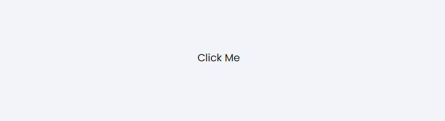
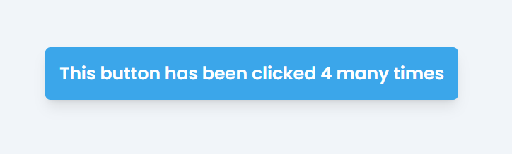
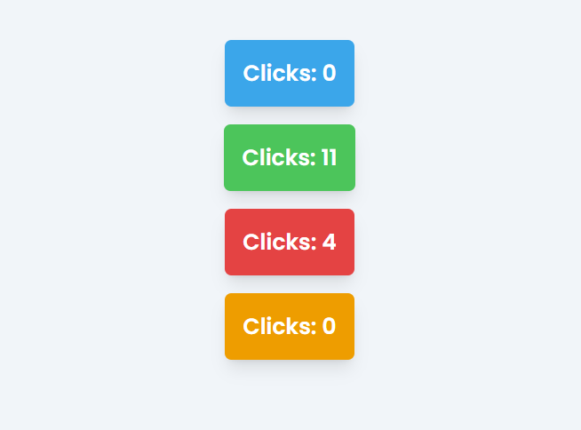
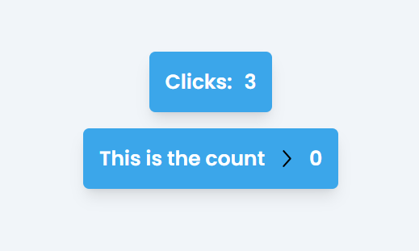

# Tutorial 1 - Next, React, Tailwind.css

Let's create a simple counter component to see how we can use React `useState`

## Setting up a Next.js project

You must have `node` installed on your computer to follow along with this tutorial - this will also give you access to the `npm` and `npx` commands

1. Open a terminal/command prompt and run the following line to create a brand new Next.js project (You can use any name for the project)

    ```sh
    npx create-next-app@latest example-project
    ```

    This will create a new folder called `example-project`

2. You will then be prompted with a few questions, agree to all the defaults e.g. Would you like to use Tailwindcss (Yes), Would you like to use Typescript (Yes)

3. Then open up the new project folder in VSCode

## CLI commands

You can run the project with the following command

```sh
npm run dev
```

which makes it available to view at http://localhost:3000

You can install additional packages and dependencies using `npm` (the node package manager) like so. Note: you can also use `npm i` which is short for `npm install`

```sh
npm install lodash date-fns ...
```

Some packages like `lodash` require additional type information to interop with Typescript, so we must install the type package as well, like so:

```sh
npm i @types/lodash
```

## Project Structure

When you open your project, you should see a structure like so (I advise creating the `/components` folder so you can add all your React components here):

```
├── app/
│   ├── page.tsx
│   ├── layout.tsx
│   ├── globals.css
│   └── ...
├── components
├── public/
│   └── ...
├── tailwind.config.ts
├── package.json
└── ...
```

### The `app` directory

Where all pages of your website live. Next uses folder routing so the path of a `page.tsx` file is the path on your site e.g:
- `app/page.tsx` would be accessible at `http://localhost:3000/` 
- `app/example/page.tsx` will be viewable at `http://localhost:3000/example`
- `app/profiles/[id]/page.tsx` will be viewable at `http://localhost:3000/profiles/john-doe/` (Yes you can create folders with `[` `]` characters in the name)

All files in the project that will contain web content (HTML + Typescript) require the `.tsx` extension

You will also notice a `layout.tsx` in the `app` directory. This file provides a structure for every page on our site, so if we wanted to add a Navigation bar to every page, we would edit this file. Next.js knows to look for files with the name `page.tsx` and `layout.tsx` so these are reserved

### The `page.tsx` files

These are our Typescript + React files which get shown as pages on our site. They will always have one of the following example structures:

```tsx
"use server"
// The first part of a page may be 'use server' (SSR) or 'use client' (CSR) i.e. cook this page on the server
// or on the user's browser

export default async function Home() {
  // You can run some logic here like loading information
  const { name } = await loadUserFromDatabase();

  // The content for the site \/ as html must be returned
  return (
    <div>
      <!-- You can use the typescript variables from the function body in the React with { ... } -->
      <p>Hello {name}, hope you are well!</p>
      ...
    </div>
  )
}
```

Page files will always have a `default export` function, so Next knows what to call to render the page. This function can be `async` if the file has "use server" at the top (SSR). [Here](https://javascript.info/async-await) is a quick guide on async/await 

Alternatively. your page may look like this (this page will be cooked on the user's browser so it can have state that updates on use actions)

```tsx
"use client" // CSR

// CANNOT BE async and cannot have awaits
export default function Home() {
  const [name, setName] = useState("pending . . .");

  // We can declare async functions inside the outer function and use
  // these callbacks to update state
  async function loadName() {
    const { name } = await loadUserFromDatabase();
    setName(name)
  }

  // Use effect is a feature we will look into later
  useEffect(() => {
    loadName();
  }, [])

  return (
    <div>
      <p>Hello {name}, hope you are well!</p>
      ...
    </div>
  )
}
```

### The `components` folder

This is a folder that you should ideally create in every project. Under it you can add a component file and name it something like `MyButton.tsx` and populate it will code like so

```tsx
"use client" // we can let Next know where this component should be rendered

interface MyButtonProps {
  label: string;
  disabled?: boolean;
  onClick: () => void;
};

// default is optional here but NEVER async
export default function MyButton({ label, onClick, disabled }: MyButtonProps) {
  return (
    <button disabled={disabled} onClick={onClick} className="bg-sky-500 p-2 hover:bg-sky-800">
      <p className="text-white font-semibold">{label}</p>
    </button>
  )
}
```

Now your button can be used anywhere in the project on any page or within other components like so:

```tsx
import MyButton from "@/components/MyButton" // import the component like this

export default async function Home() {
  // ...
  function action() {
    alert("Hi")
  }

  return (
    <div>
      <!-- Now you can use your component like any other HTML tag -->
      <MyButton label="I am a button" onClick={action}/>

      <!-- disabled is an optional prop so it can be excluded ^ -->
      <MyButton label="I am a button" onClick={action} disabled={true}/>

      <!-- disabled is a boolean prop so disabled={true} can be shortened to disabled -->
      <MyButton label="I am a button" onClick={action} disabled/>
    </div>
  );
}
```

### The `public` directory

This is where you would put all the images and non-HTML/typescript content for your website. This will allow you to use it on your site. For example if you have `public/image.png` then you can use that image in your site like so:

```tsx
import { Image } from "next";

// ...

<Image src="/image.png" width={20} height={20} alt="some-image"/>
```

### The `tailwind.config.ts` file

This file can be used to extend the tailwind classes we have available. For example, if we add `accent: "#F00"` to the config like so

```ts
export default {
  ...,
  theme: {
    extend: {
      ...,
      colors: {
        "favorite-blue": "#008AFF",
      },
    }
  }
}
```

Will can use the colour everywhere in our project with `<div className="bg-favorite-blue border-favorite-blue"> ... </div>`

## Making A Counter Component

We're gonna start simple and make a counter component. This will be a button that displays how many times it has been clicked.

Start by creating a new file `./components/CounterButton.tsx` and write out the following structure (I recommend writing this out instead of copying it to form that muscle memory)

```tsx
"use client"

export default function CounterButton() {
  return (
    <button>
      Click Me
    </button>
  )
}

```

Then navigate to your `app/page.tsx` (your index page) and add the component into the page. Import the component and use it in the body of the page

```tsx
import CounterButton from "@/components/CounterButton";

export default async function Home() {

  return (
    // These tailwind classes put our button on the center of the screen
    <div className="flex flex-col gap-4 items-center justify-center w-full h-screen">
      <CounterButton />
    </div>
  );
}

```

Your page (visiable at http://localhost:3000/) should now look like this



### Styling - Tailwind

Lets quickly make this button look appealing by adding some tailwind classes

```tsx
"use client"

export default function CounterButton() {
  return (
    <button 
      className="text-white font-semibold text-xl bg-sky-500 hover:bg-sky-600 active:bg-sky-800 hover:scale-105 active:scale-95 p-4 rounded-md transition-all duration-200 shadow-lg"
    >
      Click Me
    </button>
  )
}
```

You can find info on every style class on [Tailwind Docs](https://tailwindcss.com/docs). Explanation of each style class:
- `text-white` specifies text colour (american spelling `:(` required). You can use any of the [default](https://tailwindcss.com/docs/colors) tailwind colours or specify your own in hex with `text-[#008AFF]`
- `font-semibold` makes text bolder, you have the choice between `thin, extralight, light, normal, medium, semibold, bold`
- `text-xl` makes the text extra large (20px), you can do `xs, sm, md, lg, xl, 2xl, 3xl ... 7xl` or specify a size `text-[3rem]` or `text-[40px]`. This applies for anywhere you see the size qualifiers btw e.g. `rounded-md` can accept `rounded-[1rem]`
- `rounded-md` rounds the corners of the button's container
- `bg-sky-500` sets the background colour of the div `bg-` is short for background
- `hover:bg-sky-600` sets the background colour (i am using a darker blue) when the button is hovered over
- `active:bg-sky-700`sets the background colour (i am using an even darker blue) when the button is clicked. Full list of selectors [here](https://tailwindcss.com/docs/hover-focus-and-other-states)
- `scale-105` makes the button 5% visually bigger (this is not how you would set size but just a temporary transformation ideal for animations)
- `scale-95` 5% smaller
- `transition-all` ensures that colour and scale changes are animated
- `duration-200` all animations will take `200ms`
- `shadow-lg` adds a large drop shadow

Your button should now look like this

[Styled Button Demo](https://www.loom.com/share/79d1adbee7a44c43b033175f36cf831b?sid=d59759e1-9b19-4e7b-acb7-51cdd3a6cc5f)

### Functionality with react `useEffect`

Lets make the button count! We can give components some memory using the React `useState` hook. See below for the final product.

```tsx
"use client"
// Components that use state must be run on the users browser

import { useState } from "react"

export default function CounterButton() {
  
  // React provides a useState hook that creates a 'state' i.e. a variable that affects the 
  // way the component looks
  // it returns an array containing a value and a function to update the value
  const [count, setCount] = useState(0)


  // this function we can declare to increase the count
  function increment() {
    setCount(count + 1)
  }

  return (
    <button 
      onClick={increment} // bind the callback to the button's action
      className="text-white ..." // shortened the tailwind
    >
      Clicked {count} times
    </button>
  )
}
```
This should now produce a button that counts up every time it is pressed



First, we can declare a state variable like so where we recieve a getter (variable `x`) and setter `setX`. We provide a default value that is of type `T`. The type annotation can be left out if the type of the state can be inferred.
```tsx
const [x, setX] = useState<T>(defaultValueForX);
```

Another example, again we can remove the `<string>` since typescript can determine this from the default value

```tsx
const [name, setName] = useState<string>("john");

function test() {
  setName("Jane")
}
```

Anytime a state is updated, the entire component gets re-rendered. SO DO **NOT** DO THE FOLLOWING:

```tsx
export default function Component() {
  const [name, setName] = useState<string>("john");
  setName("jane") // dangerous code would not even run!
  
  return (
    <p>{name}</p>
  )
}
```

If you update the state inside the main body of the component function, then an infinite loop will be triggered causing the component to be rerendered repeatedly.

> **Typescript lesson 1**: unpacking
> ```ts
> const [a, b] = [1, 2, 3, 4]
> console.log(a) // 1
> console.log(b) // 2
> ```
> Javascript allows you to unpack a certain number of elements from an array like this
>
> ```ts
> const [a, b, ...c] = [1, 2, 3, 4]
> console.log(c) // [3, 4]
> ```
> You can also use the javascript spread operator to retrieve the remaining values as a separate array
>
> The same can be done for Objects
>
> ```ts
> const user = { name: "John", age: 21, street: "Strand", city: "London", country: "UK" }
> const { name, age, ...address } = user
> ```
> You will see this going forward and it is considered clean Javascript/Typescript code

### Props and extending the Component

If we want to pass values to our component to customise it, we would do something like this

```tsx
"use client"

import { useState } from "react"

// Use an interface to define the parameters we pass to out Component
interface CounterButtonProps {
  label: string;

  // optional prop, if not specified then the value will be "undefined"
  defaultValue?: number; 

  // typescript provides type unions, here we are stating the direction can be one of two values (we could also use string)
  direction?: "increment" | "decrement";

  // So we can pass custom styling for each button
  className?: string;
}

//
// Props can be specified in the arguments of the Component function
//
export default function CounterButton({ 
  label, 
  defaultValue, 
  direction = "increment", // we can provide a default value
  className 
}: CounterButtonProps) {

  const [count, setCount] = useState(defaultValue ?? 0) // we can use the ?? operator to provide an alternative if defaultValue is "undefined"

  function click() {
    if (direction === "increment") {
      setCount(count + 1)
    } else {
      setCount(count - 1)
    }
  }

  return (
    <button 
      onClick={click}
      className={"text-white ... " + (className ?? "")}
    >
      <p>{label}: {count}</p>
    </button>
  )
}
```

So we can now display the following buttons

```tsx
<>
<CounterButton label="Clicks" />
<CounterButton label="Clicks" defaultValue={10} className="bg-green-500" />
<CounterButton label="Clicks" defaultValue={5} direction="decrement" className="bg-red-500" />
<CounterButton label="Clicks" direction="decrement" className="bg-amber-500" />
```

This should look something like this:



> **Typescript lesson 2**: equality
>
> Javascript is a silly little language that would evaluate `0 == []` and `0 == "0"` as `true` whereas every other language would treat these are unequal values.
>
> So we must use the `===` and `!==` operators to check true equality (i.e. check that the variable type is also the same)
> 

## Children

We can specify a special type of prop named `children` to any component that takes in additional react code for its inner body. So lets replace the label prop with children:

```tsx
"use client"
import { useState } from "react"

interface CounterButtonProps {
  children: React.ReactNode; // Lets replace label with children
  defaultValue?: number; 
  direction?: "increment" | "decrement";
  className?: string;
}

export default function CounterButton({ 
  children, 
  defaultValue, 
  direction = "increment",
  className 
}: CounterButtonProps) {

  const [count, setCount] = useState(defaultValue ?? 0)

  function click() {
    if (direction === "increment") {
      setCount(count + 1)
    } else {
      setCount(count - 1)
    }
  }

  return (
    <button 
      onClick={click}
      className={"text-white flex gap-3 items-center ... " + (className ?? "")}
    >
      {children}
      <p>{count}</p>
    </button>
  )
}
```

Then we can use the component like this.

```tsx
<>
<CounterButton>
  <p>Clicks: </p>
</CounterButton>

<CounterButton direction="decrement" defaultValue={10}>
  <p>This is the count</p>
  <Image src="/right.svg" width={20} height={20} alt="arrow" />
</CounterButton>
```

It will look like this:



###  The `useEffect` hook

React provides a hook that allows us to respond to changes in a components state.

```tsx
"use client"
import { useState, useEffect } from "react"

interface CounterButtonProps {
  children: React.ReactNode;
  defaultValue?: number; 
  direction?: "increment" | "decrement";
  className?: string;
}

export default function CounterButton({ 
  children, defaultValue, direction = "increment", className 
}: CounterButtonProps) {

  const [count, setCount] = useState(defaultValue ?? 0)

  function click() {
    if (direction === "increment") {
      setCount(count + 1)
    } else {
      setCount(count - 1)
    }
  }

  // The useEffect hook takes in a callback and dependency array (a list of states to listen for change) 
  useEffect(() => {
    // will run every time count is updated including the first time it loads
    alert("Current count is " + count)
  }, [count])

  return (
    <button 
      onClick={click}
      className={"text-white flex gap-3 items-center ... " + (className ?? "")}
    >
      {children}
      <p>{count}</p>
    </button>
  )
}
```

The `useEffect` hook requires a callback function as its first argument and a list of states to listen for as its second argument.

```tsx
useEffect(function() { ... }, [state1, state2])
useEffect(() => { ... }, [state3])
useEffect(() => { ... }, [])
useEffect(onState4Change, [state4])
```

These are all valid `useEffect` usages. NOTE: if the dependency array is `[]` empty then the callback is only called once, when the component is first created (this is once for each new occurence of the component in your app)

> **Typescript lesson 3**: anonymous functions
>
> Javascript and typescript allow you to declare functions inline (aka lambda functions) like this
>
> ```ts
> const f = (x: number) => x + 2                  // or
> const g = (x: number) => { return 3 * x; }      // or
> const h = function (x: number) { return 3 * x; }
> ```
> This is very useful when creating quick functions inline, for example
>
> ```ts
> [1, 2, 3].map((x) => 3 * x) // [3, 6, 9]
> ```
>
> Notice how we don't specify the argument type for x here, this is infered from context i.e. the array is of type `number[]`
>

So lets employ the `useEffect` hook to achieve something useful. Lets make our button trigger an action once it reaches a target count.

```tsx
"use client"
import { useState, useEffect } from "react"

interface CounterButtonProps {
  children: React.ReactNode;
  defaultValue?: number; 
  direction?: "increment" | "decrement";
  className?: string;
  targetCount?: number // new prop - target amount
  onTargetReach?: () => void // new prop - callback function
}

export default function CounterButton({ 
  children, defaultValue, direction = "increment", className, targetCount, onTargetReach
}: CounterButtonProps) {

  const [count, setCount] = useState(defaultValue ?? 0)

  function click() {
    if (direction === "increment") {
      setCount(count + 1)
    } else {
      setCount(count - 1)
    }
  }

  useEffect(() => {
    // check that target is reached and a callback function
    // is defined
    if (count === targetCount && onTargetReach !== undefined) {
      onTargetReach()
    }
  }, [count])

  return (
    <button 
      onClick={click}
      className={"text-white flex gap-3 items-center ... " + (className ?? "")}
    >
      {children}
      <p>{count}</p>
    </button>
  )
}
```

Then we can use this in our website like so:

```tsx
"use client" 
// we need to make this page client side (browser) side
// as we are passing a callback down into a client side component (CounterButton)
// + the alert method is a browser side function aswell

import CounterButton from "@/components/CounterButton";

export default function Home() {
  return (
    <div className="flex flex-col gap-4 items-center justify-center w-full h-screen">
      <CounterButton
        targetCount={10} 
        onTargetReach={() => alert("Hi")}
      >
        <p>Count:</p> 
      </CounterButton>
    </div>
  );
}
```

### Conditionals and Loops

Now lets focus on more react functionality to help us make more contentful websites faster. Lets say we want to change some text once our `targetCount` is reached i.e. conditional rendering

```tsx
"use client"

import CounterButton from "@/components/CounterButton";

export default function Home() {
  const [complete, setComplete] = useState(false)
  return (
    <div className="flex flex-col gap-4 items-center justify-center w-full h-screen">
      
      <!-- We are using the JS ternary operator like an if statement to render one of two p tags based on a condition -->
      { complete 
        ? <p>You have done it!</p>
        : <p>Keep pressing the button</p>
      }

      <CounterButton
        targetCount={10} 
        onTargetReach={() => setComplete(true)}
      >
        <p>Count:</p> 
      </CounterButton>
    </div>
  );
}
```

> **Typescript lesson 4**: ternary operator
> 
> Javascript as well as other high level languages offer a ternary operator that will enable you to select between two values in an expression conditionally, like an `if` statement
>
> ```ts  
> const a = 5 > 3 ? "A" : "B" // evaluate s to "A"
> ```
>
> 
>
> ```tsx
> const a = password === "secret" 
>    ? <a href="/secret/location">access resource</a> 
>    : <p>wrong password</p>
> ```
>